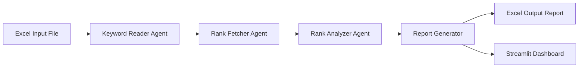

# 📊 Keyword Ranking Analysis System

## 📌 Project Overview

The **Keyword Ranking Analysis System** is a Python-based SEO analysis project designed to determine how a website ranks for a given set of keywords on Google.  
The system processes an Excel input file containing keywords and target URLs, fetches search results using a Google Search API, and generates a structured ranking report along with an optional Streamlit dashboard.

This project is built with **real-world SEO constraints** in mind and follows an **API-based ranking approach**, ensuring **reliable, reproducible, and policy-compliant results**.

---

## 🎯 Problem Statement

SEO professionals and businesses need to continuously monitor keyword rankings to evaluate website visibility and search performance.

Manual keyword checking is:
- Time-consuming  
- Inconsistent due to personalization and location bias  
- Not scalable for large keyword sets  

The objective of this project is to **automate keyword ranking analysis** and present results in a **clean, professional, and explainable format**.

---

## ✅ Proposed Solution

The system automates keyword ranking analysis through the following steps:

1. Accepts an Excel input file containing:
   - `keyword`
   - `url`
2. Fetches Google search results using a **Search API**
3. Analyzes:
   - **Organic search rankings**
   - **Google Places / Local Pack visibility (when available)**
4. Determines:
   - Ranking position
   - Search results page number
5. Generates:
   - A structured Excel ranking report
   - An interactive Streamlit dashboard

The solution prioritizes **accuracy, transparency, and ethical data usage**.

---

## 🔄 Workflow Orchestration (LangGraph)



---

## 📄 Input File Format

**Excel File (`keywords_input.xlsx`)**

| keyword | url |
|-------|-----|
| tiffin services in noida | https://www.omorganickitchen.com/our-services/ |
| healthy food delivery | https://example.com |

---

## 📊 Output File Format

**Excel Report (`keyword_ranking_report.xlsx`)**

| keyword | url | google places | google links | page number |
|------|-----|---------------|--------------|-------------|
| tiffin services in noida | omorganickitchen.com | 2 | 3 | Page 1 |
| healthy food delivery | example.com | Not Found | Not Found | N/A |

---

## 📌 Column Explanation

- **google places**  
  Indicates the ranking position within Google Places / Local Pack **if a local pack is present** for the keyword.  
  If no local pack is returned by Google Search, the value is marked as **Not Found**.

- **google links**  
  Organic Google ranking position of the target URL.

- **page number**  
  Search results page corresponding to the organic rank.

- **Not Found**  
  Indicates that the URL did not appear within the checked search results range or that Google did not return a local pack.

---

## 📍 Google Places (Local Pack) Ranking Logic

- Google Places rankings are **conditional** and depend on:
  - Keyword local intent (e.g., “near me”, city/area-based queries)
  - Google Search UI behavior
  - Availability of local pack results in API response
- The system **does not guess or force** Places rankings.
- If Google Search does not return a local pack for a keyword, the system correctly reports **Not Found**.

This behavior mirrors how professional SEO tools handle local visibility.

---

## ⚠️ Important SEO Notes & Limitations

- Rankings are based on **API-level Google search results**
- Results may differ from manual Google searches due to:
  - Location resolution differences
  - Search personalization
  - Ads, maps, and UI-based elements not counted as organic results
- Google Places results are **not guaranteed for all keywords**
- The system prioritizes **data correctness over assumptions**

---

## 🖥️ Streamlit Dashboard

The Streamlit dashboard provides:

- Excel file upload
- One-click keyword ranking analysis
- KPI-style summary metrics
- Tabular ranking visualization
- Downloadable Excel report

### ▶️ Run Dashboard

```bash
streamlit run dashboard/app.py

