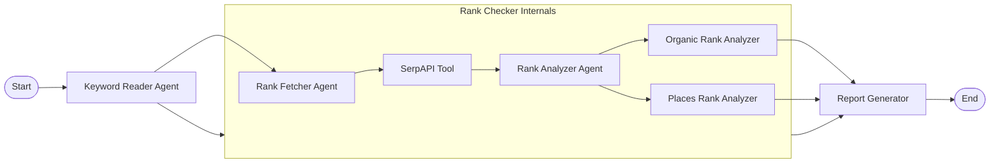

# 🧠 LangGraph Orchestration Diagram

```mermaid
flowchart LR

    %% High-level flow
    Start([Start])
    Reader[Keyword Reader Agent]
    RankChecker[Rank Checker]
    Report[Report Generator]
    End([End])

    Start --> Reader --> RankChecker --> Report --> End

    %% Rank Checker internals
    subgraph RankChecker["Rank Checker Internals"]
        RF[Rank Fetcher Agent]
        API[SerpAPI Tool]
        RA[Rank Analyzer Agent]
        ORG[Organic Rank Analyzer]
        PLC[Places Rank Analyzer]

        RF --> API
        API --> RA
        RA --> ORG
        RA --> PLC
    end

    %% Logical connections
    Reader --> RF
    ORG --> Report
    PLC --> Report
    
```